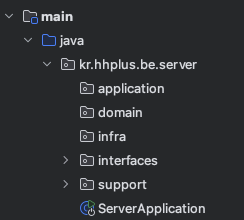

**문서 목록**

---

## 1. 요구사항 분석
 - [마일스톤](docs/milestone.md)
 - [시퀀스 다이어그램](docs/sequenceDiagram.md)
 - [클래스 다이어그램](docs/classDiagram.md)
 - [ERD](docs/erd.md)
 
## 2. Mock API 및 Swagger-API 작성

- [API 명세서](https://app.swaggerhub.com/apis-docs/geonyeop123/hhplus-e-commerce/1.0.0#/)

## 3. Software Architecture Pattern

### Clean + Layered Architecture

interfaces
 - Controller와 해당 계층에서 사용되는 DTO (Request, Response)가 포함됩니다.
 - 운영 코드와 Swagger의 코드가 공존하지 않기 위해서 Docs interface를 사용합니다.
 - application의 facade를 호출하거나, domain의 service를 호출합니다.

application
 - Facade와 DTO(Criteria, Result)가 포함됩니다.

domain
 - Service와 DTO(Command, Domain), Repository가 포함됩니다.

infra
 - RepositoryImpl이 포함됩니다.

## 4. 조회 관련 성능 보고서

 - [인기상품 조회 성능 보고서](docs/search.md)