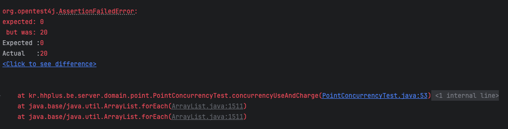
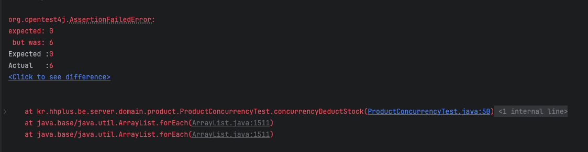

# 동시성 제어 테스트

### Point 충전 및 사용

0포인트인 상태에서 10포인트씩 5번 충전, 사용을 번갈아가면서 시도했을 때 보유 포인트는 0포인트를 기대하였지만 여분의 포인트가 남아있는 경우로 테스트가 종료되었다.



```java
    @DisplayName("동시에 충전과 사용을 요청하여도 정상적으로 수행된다.")
    @Test
    @Commit
    @Sql(scripts = "/sql/point.sql", executionPhase = Sql.ExecutionPhase.BEFORE_TEST_METHOD)
    void concurrencyUseAndCharge() throws InterruptedException {
        // given
        Long userId = 1L;
        int threadCount = 10;
        ExecutorService executorService = Executors.newFixedThreadPool(threadCount);
        CountDownLatch latch = new CountDownLatch(threadCount);

        // when
        for (int i = 0; i < threadCount; i++) {
            int index = i;
            executorService.submit(() -> {
                if (index % 2 == 0) {
                    pointService.use(new PointCommand.Use(userId, 10));
                } else {
                    pointService.charge(new PointCommand.Charge(userId, 10));
                }
                latch.countDown();
            });
        }

        latch.await(); // 모든 작업이 끝날 때까지 대기

        // then
        Point finalPoint = pointRepository.findByUserId(userId).orElseThrow();
        assertThat(finalPoint.getBalance()).isEqualTo(0); // 총합 결과
    }
```

테스트 방식은 저번 1주차 때 CountDownLatch를 사용했던 것과는 다르게 ExecutorService를 사용하였다. 

컨텍스트 관리나 예외 핸들링이 쉽다고는 하는데 아직 그러한 상황은 발생하지 않아서 잘 모르겠다. 조금 더 코드 읽기가 편하다 ??

추후에 동시성 제어 관련해서 수업들을 받고 나서 해당 이점을 알게 되지 않을까 싶다.

### 재고 차감

재고 차감 로직도 동일하게 10개의 재고가 남아있는 상품에 대해 1개씩 10번 차감을 시도하였는데, 0개를 기대하였으나 조금 더 남아있었다.



```java
    @DisplayName("동시에 재고차감이 이루어져도 정상적으로 재고가 차감된다.")
@Test
@Commit
@Sql(scripts = "/sql/product.sql", executionPhase = Sql.ExecutionPhase.BEFORE_TEST_METHOD)
void concurrencyDeductStock() throws InterruptedException {
    // given
    Long productId = 1L;
    int threadCount = 10;
    ExecutorService executorService = Executors.newFixedThreadPool(threadCount);
    CountDownLatch latch = new CountDownLatch(threadCount);

    // when
    for (int i = 0; i < threadCount; i++) {
        executorService.submit(() -> {
            ProductCommand.DeductStock command = new ProductCommand.DeductStock(productId, 1);
            productService.deductStock(command);
            latch.countDown();
        });
    }

    latch.await(); // 모든 작업이 끝날 때까지 대기

    // then
    Product finalproduct = productRepository.find(productId).orElse(null);
    assertThat(finalproduct).isNotNull();
    assertThat(finalproduct.getStock()).isEqualTo(0);
}
```

### 동시성 제어 테스트할 때 유의점

데이터 클렌징을 위해 @Transactional을 테스트 클래스에 붙여놓았다.

```java
@SpringBootTest
@Transactional
class ProductConcurrencyTest {
}
```

그런데, 해당 어노테이션이 있으면 commit이 되지 않아서 동시성 테스트가 원하는 방향으로 실패하지 않았다.

이에 동시성 테스트 파일을 별도로 분리하였고, 테스트 메서드에 Commit 어노테이션을 붙여주었다.

```java
    @DisplayName("동시에 재고차감이 이루어져도 정상적으로 재고가 차감된다.")
    @Test
    @Commit
    @Sql(scripts = "/sql/product.sql", executionPhase = Sql.ExecutionPhase.BEFORE_TEST_METHOD)
    void concurrencyDeductStock() throws InterruptedException {

    }
```