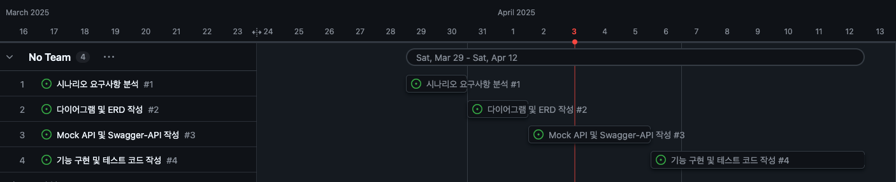

## 1. 요구사항 분석
- [마일스톤](milestone.md)
- [시퀀스 다이어그램](sequenceDiagram.md)
- [클래스 다이어그램](classDiagram.md)
- [ERD](erd.md)

---

## 마일스톤

[프로젝트 마일스톤](https://github.com/users/geonyeop123/projects/1/views/1)

