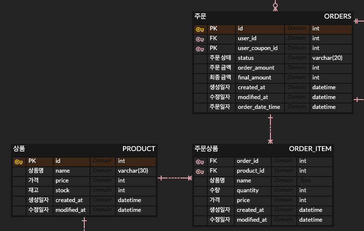
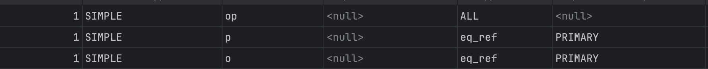
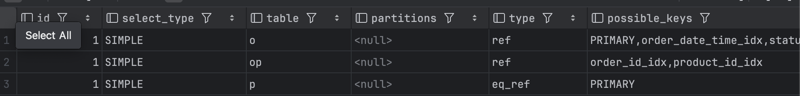
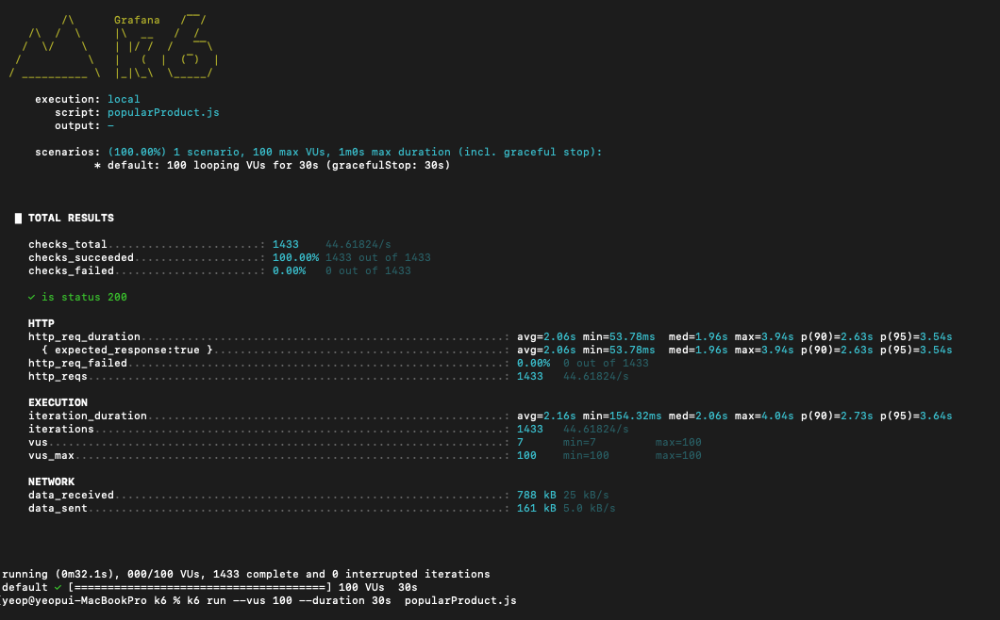
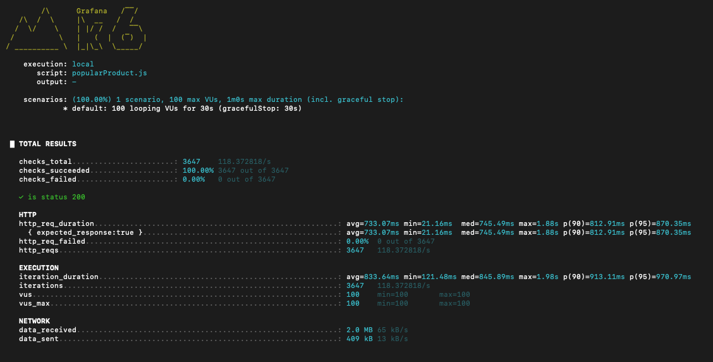

# 인기상품 조회 성능 보고서

## 개요

3일간 가장 판매가 많이 된 상품 5개를 조회할 수 있는 API 이하 '인기 상품 조회' 혹은 '기능' 이라 칭한다.

해당 기능은 메인 페이지 최초 접속 시 API를 요청하며, 많은 트래픽이 발생할 수록 Database에 요청이 많아져 병목현상이 발생할 수 있다.

## 테이블 구조도



해당 기능은 위의 테이블을 참조하게 되며, 아래와 같은 쿼리로 조회를 할 수 있다.

```sql
SELECT op.product_id, SUM(op.quantity) AS total_quantity, p.name, p.price, p.stock
FROM order_product op
         JOIN orders o ON op.order_id = o.id
         JOIN product p ON op.product_id = p.id
WHERE o.status = 'SUCCESS'
  AND o.order_date_time >= DATE_SUB(CURDATE(), INTERVAL 3 DAY)
GROUP BY op.product_id, p.name, p.price, p.stock
ORDER BY total_quantity DESC LIMIT 5;
```

SQL로 유저 100명, 상품 1000개, 오더 10,000개를 넣어서 테스트를 진행했다.

(CommandLineRunner로 프로젝트에서 직접 넣어봤는데, orderDateTime을 now로 넣어주고 있어서 제대로 된 데이터 입력이 불가했다.)

모든 테이블은 PK만 있으며, 인덱스는 설정하지 않은 상태이며, 실행계획을 돌려보면 아래와 같은 결과를 받을 수 있다.


```sql
-> Limit: 5 row(s)  (actual time=32..32 rows=5 loops=1)
    -> Sort: total_quantity DESC, limit input to 5 row(s) per chunk  (actual time=32..32 rows=5 loops=1)
        -> Table scan on <temporary>  (actual time=31.7..31.8 rows=828 loops=1)
            -> Aggregate using temporary table  (actual time=31.7..31.7 rows=828 loops=1)
                -> Nested loop inner join  (cost=1698 rows=1008) (actual time=0.25..27.7 rows=1778 loops=1)
                    -> Nested loop inner join  (cost=1345 rows=1008) (actual time=0.241..22.1 rows=1778 loops=1)
                        -> Filter: ((o.order_date_time >= <cache>((curdate() - interval 3 day))) and (o.`status` = 'SUCCESS'))  (cost=992 rows=1008) (actual time=0.22..8.71 rows=1778 loops=1)
                            -> Table scan on o  (cost=992 rows=9678) (actual time=0.21..5.66 rows=10000 loops=1)
                        -> Filter: (op.product_id is not null)  (cost=0.25 rows=1) (actual time=0.00546..0.00649 rows=1 loops=1778)
                            -> Index lookup on op using order_id_idx (order_id = o.id)  (cost=0.25 rows=1) (actual time=0.00516..0.00609 rows=1 loops=1778)
                    -> Single-row index lookup on p using PRIMARY (id = op.product_id)  (cost=0.25 rows=1) (actual time=0.00275..0.00283 rows=1 loops=1778)
```

실행결과는 다음과 같다. 풀스캔이 발생하고 있는데, 이를 한 번 인덱스를 걸어서 테스트를 진행해보자.

인덱스는 order_product에 order_id, product_id를 걸어주었고, 

orders에 order_date_time, status에 걸어두었다.



효과는 굉장했다 ! 

하지만 데이터의 문제인지 order_id와 order_date_time에 걸었을 때에는 효과가 컸지만, 이외의 인덱스는 효과가 그렇게 크지 않았다.

아무래도 product_id보다 order_id가 카디널리티가 높기 때문인 것 같다.

직접 API를 콜 했을 때의 상황도 보고 싶었다.

코치님께서 살짝 언급해주시고, 이전 수강생들의 코드를 봤을 때 K6라는 키워드를 본 적이 있다.

해당 프로그램으로 성능 테스트를 진행해보자.

## 성능 테스트 (K6를 곁들인)

K6는 JS파일 기반으로 실행되는 툴이었다. 파일을 만들어보자

```javascript
export const options = {
    stages: [
        { duration: '10s', target: 50 },   // 0 → 50명까지 증가
        { duration: '20s', target: 100 },  // 유지
        { duration: '10s', target: 200 },  // 더 증가
        { duration: '10s', target: 0 },    // 감소 및 종료
    ],
};

export default function () {
    const res = http.get('http://localhost:8080/api/v1/stats/products/popular');
    check(res, {
        'is status 200': (r) => r.status === 200,
    });
    sleep(1); // 사용자당 1초 대기
}
```

되게 간단하다. 순차적으로 유저들이 증가했다가 감소하는 것까지 세팅이 가능한 것 같다. 결과를 한번 보자

뭐가 뭔지 몰라서 GPT에 물어보니 아래와 같은 데이터를 집중해서 보라고 했다.

| 항목                | 설명                  | 주의해야 할 기준                      |
|-------------------|---------------------|--------------------------------|
| http_req_duration | 응답 시간 (ms) 평균, 최소   | avg > 300ms이면 병목 가능성           |
| http_reqs         | 전체 요청 수             | 적으면 부하가 충분히 안 걸린 것             |
| vus               | 가상 유저 수             | 올릴수록 병목 쉽게 드러남                 |
| status was 200    | HTTP 성공률            | 실패율이 있다면 서버 문제 (예: 500, 503 등) |
| p(90) p(95)       | 상위 90%, 95% 응답 시간   | 사용자 대부분의 실제 체감 속도              |

자 이제 결과를 봐보자.





인덱스 적용 전과 인덱스 적용 후이다.

인덱스 적용 전의 complete 값이 후보다 2배 정도 낮은데 성능은 3배 정도 올라갔다.

물론 별도의 통계 테이블을 둔다면 더 좋은 성능을 낼 수 있겠지만, 이 것으로 마치는 것이 좋겠다.

(추후 과제로 토스 ,,)