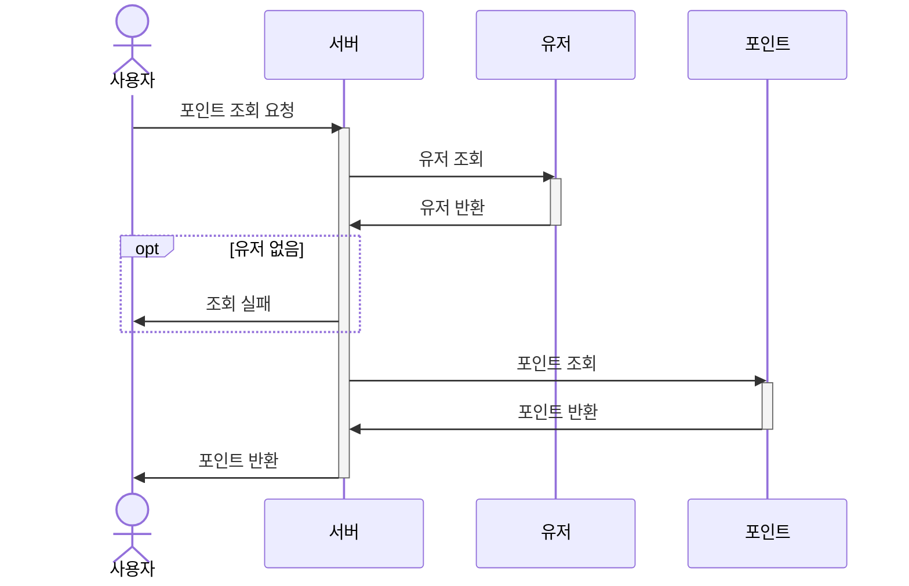
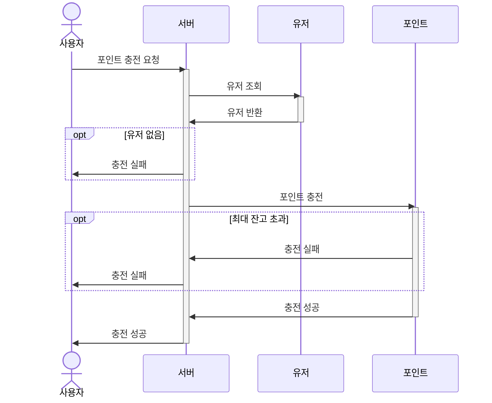
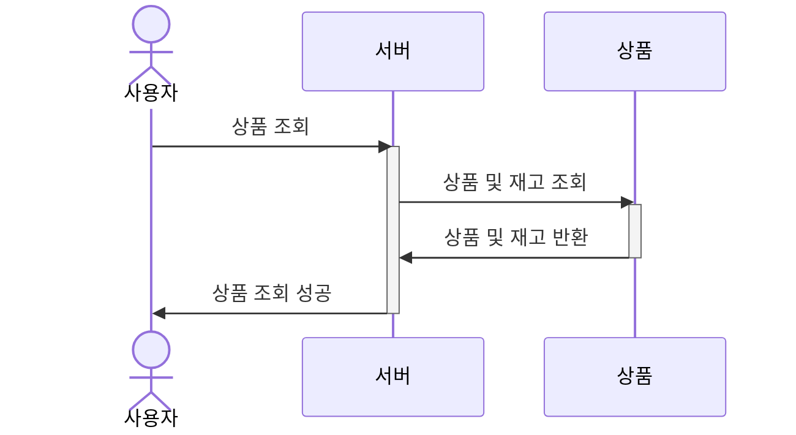
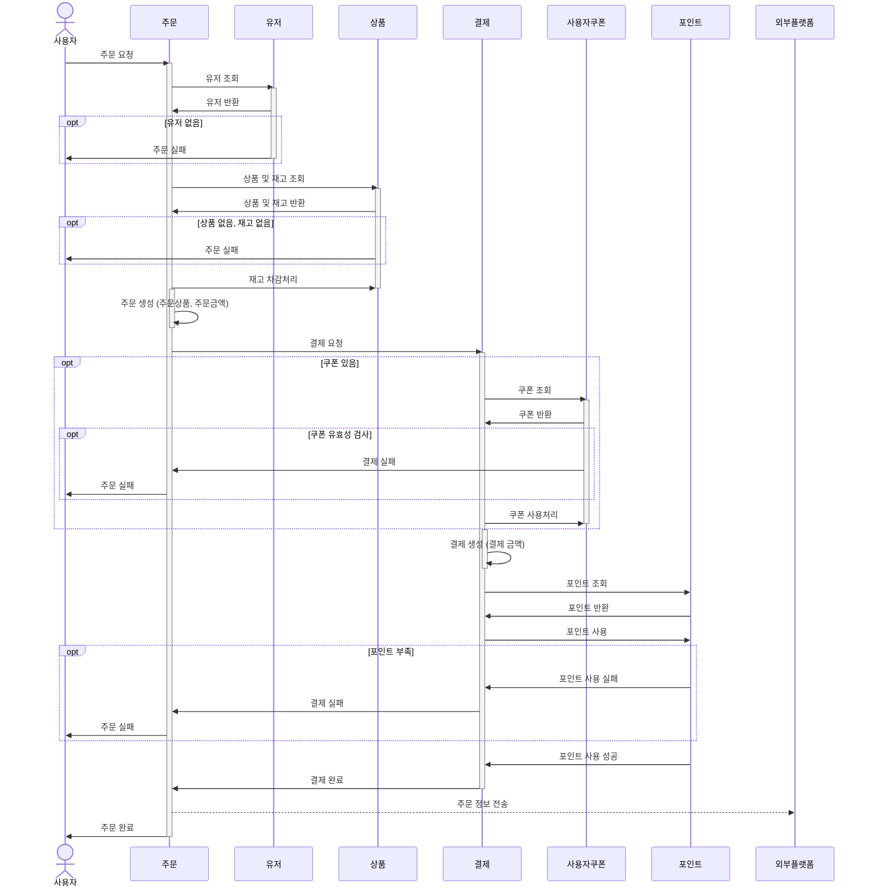
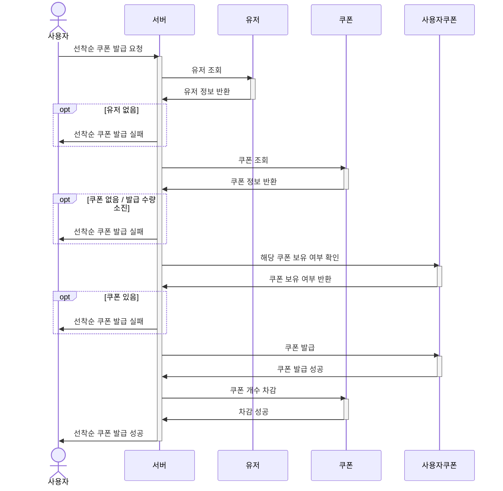
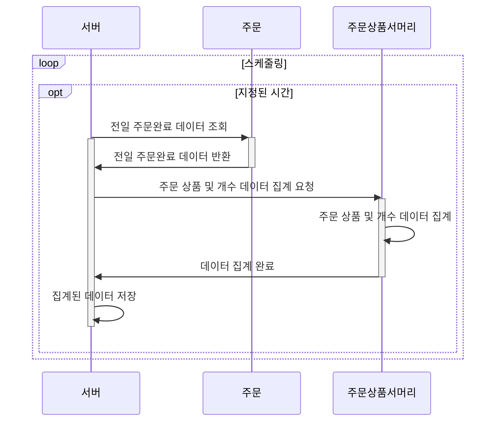
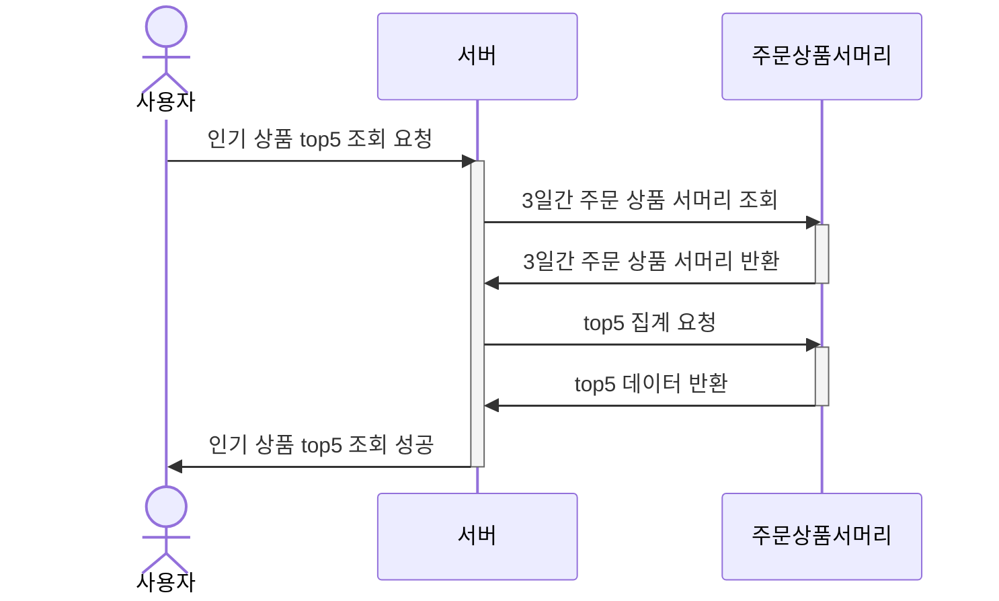

## 1. 요구사항 분석
- [마일스톤](milestone.md)
- [시퀀스 다이어그램](sequenceDiagram.md)
- [클래스 다이어그램](classDiagram.md)
- [ERD](erd.md)

---

## 시퀀스 다이어그램

* [1. 포인트 조회](#포인트-조회)
* [2. 포인트 충전](#포인트-충전)
* [3. 상품 조회](#상품-조회)
* [4. 주문 및 결제](#주문-및-결제)
* [5. 선착순 쿠폰 발급](#선착순-쿠폰-발급)
* [6. 인기 상품 스케줄링](#인기-상품-스케줄링)
* [7. 인기-상품-조회](#인기-상품-조회)

## 포인트 조회

## 포인트 충전

## 상품 조회

## 주문 및 결제

## 선착순 쿠폰 발급

## 인기 상품 스케줄링

## 인기 상품 조회

